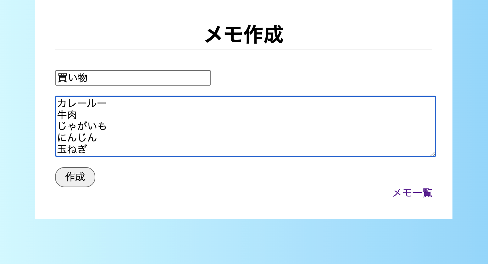
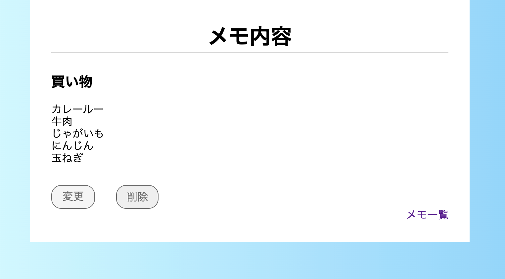
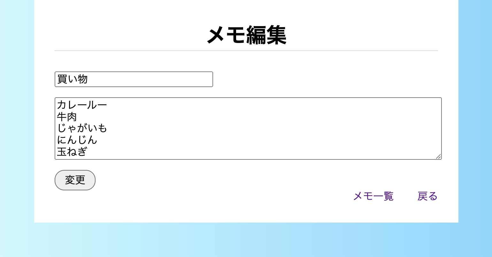

# memo sampleapp

このアプリは、[フィヨルドブートキャンプ](https://bootcamp.fjord.jp)の学習課題として作られたものです。

## 概要

ローカルで立ち上げ、ブラウザ上で使うことのできるメモアプリになります。

## 使い方

### アプリのダウンロード
最初に、リモートリポジトリからローカルへダウンロードします。

```
git clone https://github.com/Kassy0220/memo_app
```

作成されたメモアプリのディレクトリに移動し、アプリを実行するために必要なGemをダウンロードします。

```
$ cd memo_app
$ bundle install
```

### DBの設定
このアプリでは、ローカルにDBを作成してそこにメモを保存します。
DBの設定は、次の手順で行います。
1. PostgreSQLをダウンロードする
2. DBにアクセスするユーザを作成する
3. DBを作成する
4. テーブルを作成する

1. PostgreSQLのダウンロード
以下のサイトを参考に、お使いのOSに合わせてダウンロードを行なってください。
[ダウンロード \| 日本PostgreSQLユーザ会](https://www.postgresql.jp/download)

2. ユーザの作成
ダウンロードが完了したら、コマンドライン上で次のコマンドを実行し、DBにアクセスするユーザを作成します。
```
$ createuser --interactive memo_user
```
コマンドを実行すると、Yes/Noの入力を促されます。
DBを作成する必要があるため次の項目はYesを選択し、それ以外の項目はNoを選択してください。
```
Shall the new role be allowed to create databases? (y/n) 
```

3. DBの作成
ユーザを作成したら、次はDBの作成を行いましょう。
先ほど作成したユーザで、PostgreSQLの対話的ターミナルを起動します。

```
psql -U memo_user
```

プロンプトが`sample=>`に変わるので、次の文を実行し、DBを作成します。

```
sample => CREATE DATABASE memo_app;
```

DBの作成は完了しました。
`exit`を実行してPostgreSQLのターミナルから抜けておきましょう。

4. テーブルの作成
最後にテーブルを作成します。

コマンドライン上で次のコマンドを実行すればテーブルが作成されます。
```
ruby create_table.rb
```

DBの設定は以上です。
これにより、アプリを実行する準備が整いました。

ターミナル上で次のコマンドを実行して、メモアプリを起動しましょう。

```
$ bundle exec ruby memo.rb
```

ブラウザを起動し、次のURLにアクセスします。

`http://localhost:4567/memos`

メモアプリを終了するには、ターミナル上で`Ctrl` + `C`を入力します。

### メモアプリのページ

メモアプリには次の4つのページがあります。
+ メモ一覧ページ
+ メモ作成ページ
+ メモ内容ページ
+ メモ編集ページ

メモ一覧ページでは、作成されたメモが一覧で表示されます。

上記のURLで表示されるのが、このメモ一覧ページになります。


メモ作成ページでは、「タイトル」と「メモの内容」を入力し、作成ボタンを押すとメモを作成することができます。

メモのタイトルと内容が空白の状態でメモを作成することはできません。



メモ内容ページでは、メモの内容が表示されます。

変更ボタンを押すと編集ページに移動し、削除ボタンを押すとメモが削除されます。



メモ編集ページでは、変更する内容を入力し、変更ボタンを押すとメモが変更されます。

メモ作成時と同じく、タイトルと内容が空白の状態でメモを変更することはできません。


